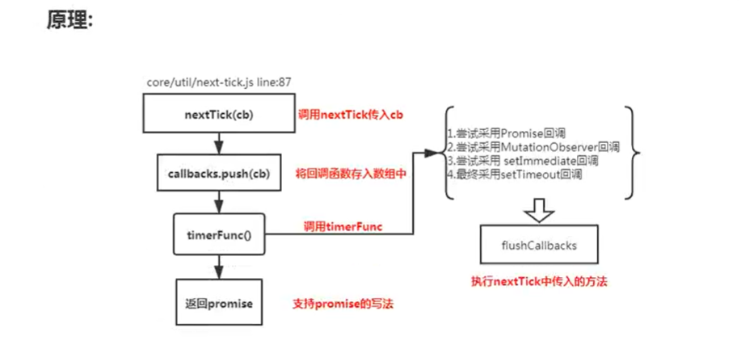
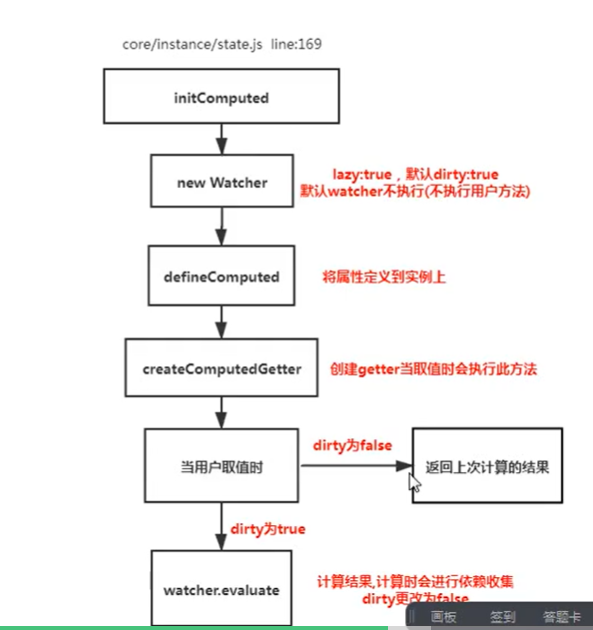

### 说说mvvm的原理的理解
- MVVM： 传统的前端是将数据手动渲染到页面上，MVVM模式不需要用户手动操作dom元素，将数据绑定到viewMdel曾上，会自动将数据渲染到页面中，视图变化会通知viewModel层更新数据，viewModel就是我们MVVM模式中的桥梁

### 请说一下响应式数据的原理
- 核心点：Object.property
- 默认vue在初始化数据时，会给data中的属性使用object.defineProperty重新定义所有属性，当页面取到对应属性时，会进行依赖收集(收集当前组件的watcher)如果属性变化会通知相关依赖进行更新操作
- 原理 initData(初始化用户传入的data数据) -> new Observer(将数据进行观测) -> this.walk(value) 进行对象的处理 -> defineReactive(循环对象属性定义响应式变化) -> Object.defineProperty(使用Object.defineProperty重新定义数据)

### vue中时如何检测数据变化的
- 改变数组的7中方法(push pop shift unshift reverse sort splice)
- 使用函数劫持的方式，重写了数据的方法
- Vue将data中的数组，进行了原型链重写。指向了自己定义的数组原型方法，这样当调用api时，可以通知依赖更新，如果数组中包含着引用类型，会对数组中的引用类型再次进行监控
- 总结：更改数组原型(调用数组方法的时候，同时调用自定义的方法，通知视图更新)，会对数组中每一项进行观测

### 为何vue采用异步渲染
- 每次属性对应一个dep，dep中存贮了watcher，更新的时候会过滤掉重复watcher，将watcher放到一个队列中，然后异步的进行更新watcher的update方法
- 因为不采用异步更新，那么每次更新数据都会对当前组件进行重新渲染，所以为了性能考虑，vue会在本轮数据更新后，再去异步更新视图
- 原理： dep.notify()(通知watcher进行更新操作) -> subs[i].update()(依次调用watcher的update) -> queueWatcher(将watcher重新放到队列中) -> nextTick(flushSchedulerQueue)(异步清空watcher队列) 

### nextTick实现原理
- nextTick方法主要是使用了宏任务和微任务，定义了一个异步方法，多次调用nextTick会将方法存入到队列中，通过这个异步方法清空当前队列，所以这个nextTick方法是异步方法


- 注意：在Vue 2.4之前的版本中，nextTick几乎都是基于microTask实现的（具体可以看文章nextTick一节），但是由于microTask的执行优先级非常高，在某些场景之下它甚至要比事件冒泡还要快，就会导致一些诡异的问题；但是如果全部都改成macroTask，对一些有重绘和动画的场景也会有性能的影响。所以最终nextTick采取的策略是默认走microTask，对于一些DOM的交互事件，如v-on绑定的事件回调处理函数的处理，会强制走macroTask， 但是在2.6版本有改回了2.4的方案，因为找到像冒泡类似事件的解决方案.例如下题2.4和2.6表现一致
```
<template>
    <div id="example">
        <span>{{test}}</span>
        <button @click="handleClick">change</button>
    </div>
</template>

<script>
    export default {
        data() {
            return {
                test: 'hello world'
            }
        },
        methods: {
            handleClick: function() {
                this.test = 'end';
                console.log('script')
                Promise.resolve().then(function () {
                    console.log('promise')
                })
                this.$nextTick(function () { 
                    console.log('nextTick')
                })
                
            }
        }
    }

    // 2.6和2.4都是 script nextTick promise
    // 在2.5中则是 script promise nextTick， 因为2.5中的nextTick跟事件有关，使用的时宏任务
</script>
```

### vue中computed watch methods的区别
- computed也是一个watcher，是具备缓存的，只有当依赖的属性发生改变时才会更新视图
- 至于watch和computed，watch会先执行，computed会在取值的时候再去执行



### watch中的deep:true是如何实现的
- 当用户指定了deep属性为true时。如果当前监控的值是数组类型，会对对象中的每一项进行求值，此时会将当前watcher存入到对应的属性依赖中，这样数组中对象发生变化时也会通知更新

### ajax请求放在哪个生命周期中
- 在created的时候，视图中的dom没有更新，所以此时直接操作dom节点，无法找到相关元素
- 在mounted中，由于此时dom已经渲染出来了，所以可以直接操作dom节点
- 一般情况下，为了保持统一性，放到mounted中，因为生命周期时同步执行的
- 服务器端没有mounted方法，所以服务端渲染一般放到created中

### 何时需要使用beforeDestory
- 可能在当前页使用了$on方法，那需要在组件销毁前解绑
- 清除自己定义的定时器
- 解绑事件的绑定的scroll mousemove

### v-for中为啥要用key

### 描述组件渲染和更新的过程
- 渲染组件时，会通过Vue.extend方法构建子组件得构造函数，并进行实例化。最终手动调用$mount()进行挂载。更新组件时会进行patchVnode流程，核心就是diff算法

### 组件中得data为什么是一个函数
```
function VueComponent() {}
VueComponent.prototype.$options = {
    data: {name: 'zf'}
}
let vc1 = new VueComponent()
vc1.$options.data = 'js'
let vc2 = new VueComponent() 
console.log(vc2.$options.data)
```
- 同一个组件被复用多次，会创建多个实例。这些实例用的是同一个构造函数，如果data是一个对象得话，那么所有组件都共享同一个对象。为了保证组件得数据独立性要求每个组件必须通过data函数返回一个对象作为组件得状态
- 关于Vue.extend：通过一个对象创建了一个构造函数，跟vue得构造函数没有关系，通过extend产生了一个子函数，子函数需要有vue上得所有东西，所以需要做一次合并
- 引申，为什么new Vue({data: {}})中得data可以是一个对象，因为他不用考虑复用得问题

### vue中事件绑定得原理,一种原生事件绑定,一种组件事件得绑定
- 原生事件得绑定采用得时addEventListener实现
- 组件绑定事件采用的是$on方法
- 组件中nativeOn 等价于 普通元素on 组件on会单独处理
- 组件的on单独处理是通过发布订阅模式例如一个test组件 test.$on('click', () => {})  test.$emit('click')

### v-model中的实现原理及如何自定义v-model
- 组件的v-model 就是value + input方法的语法糖
- 如果时input就是value + input事件，如果是checkbox那么就是checked + change事件，有一个运行时指令文件，根据标签不同，触发不同的事件

### vue中v-html会导致那些问题
- 可能会导致xss攻击
- v-html会替换掉标签内部的子元素

### vue父子组件生命周期调用顺序
- 加载渲染过程
- 父beforeCreate -> 父created -> 父beforeMount -> 子beforeCreate -> 子created -> 子beforeMount -> 子mounted -> 父mounted
- 父子组件的更新过程
- 父beforeUpdate -> 子beforeUpdate -> 子updated -> 父updated
- 销毁过程
- 父beforeDestroy -> 子beforeDestroy -> 子destroyed -> 父destroyed
- 总结： 调用的顺序肯定是先父后子，渲染肯定是先子后父。 销毁操作肯定是先父后子，销毁完成肯定是先子后父


### vue组件如何通信
- 父子间通信 父 -> 子通过props 子 -> 父 $on $emit
- 获取父子组件实例的方式$parent $children
- 在父组件中提供数据子组件进行消费Provide inject
- ref获取实例的方式调用组件的属性或者方法
- Event Bus实现跨组件通信
- Vuex状态管理实现通信
- $attrs $listeners

### vue中相同的逻辑如何抽离  Vue.mixin在vue3.0中componentAPI代替
- Vue.mixin 用法，给组件每个生命周期、函数等都混入一些公共逻辑
- 全局注册和选项合并两种用法

### 为什么要使用异步组件
- 如果组件功能多打包出的结果会变大，我可以采用异步方式来加载组件， 主要依赖import()这个语法，可以实现文件的分割加载
- 异步组件的一些api，可以配置加载状态。
```
components: {
    AddCustomerSchedule: (resolve) => import("../components/AddCustomer")
}
```

### 什么是作用域插槽
- 插槽： 
    1. 创建组件虚拟节点时，会将组件的儿子的虚拟节点保存起来。当初始化组件时，通过插槽属性将儿子进行分类{a:[vnode], b: [vnode]}
    2. 渲染组件时会拿对应的slot属性的节点进行替换操作。(插槽的作用域为父组件)

- 作用域插槽
    1. 作用域插槽在解析的时候，不会作为组件的孩子节点。会解析成函数，当子组件渲染时，会调用此函数(并传递参数)进行渲染。(插槽的作用域为子组件)

### 谈谈你对keep-alive的了解
- keep-alive可以实现组件的缓存，当组件切换时不会对当前组件进行卸载，常用的2个属性include/exclude，2个生命周期activated，deactivated    
- LRU算法
- keep-alive放多个组件的话，只会缓存第一个组件

### Vue中常见性能优化
- 编码优化
    1. 不要将所有的数据都放在data中，data中的数据都会增加getter和setter，会收集对应的watcher
    2. vue在v-for时给每项元素绑定事件需要用事件代理
    3. spa页面采用keep-alive缓存组件
    4. 拆分组件(提高复用性，增加代码的可维护性，减少不必要的渲染)
    5. v-if当值为false时内部指令不会执行，具有阻断功能，很多情况下使用v-if替代v-show
    6. key保证唯一性(默认vue会采用就地复用策略)
    7. Object.freeze冻结数据
    8. 合理使用路由懒加载、异步组件
    9. 尽量采用runtime运行时版本
    10. 数据持久化问题(防抖、节流)
- vue加载性能优化
    1. 第三方模块按需引入(babel-plugin-component)
    2. 滚动到可视区域动态加载
    3. 图片懒加载
- 用户体验
    1. app-skeleton骨架屏
    2. app-shell app壳
    3. pwa (service-worker)
- seo 优化
    1. 预渲染插件prerender-spa-plugin
    2. 服务端渲染ssr
- 打包优化
    1. 使用cdn的方式加载第三方模块
    2. 多线程打包happypack

### Vue3.0你知道有哪些改进
- vue3采用ts编写
- 支持Composition API
- vue3中响应式数据原理改成proxy
- vdom的对比算法更新，只更新vdom的绑定了动态数据的部分

### 实现hash路由和history路由
- onhashchage
- history.pushState

### Vue-Router中导航守卫有哪些
- 导航被触发
- 在失活的组件中调用离开守卫
- 调用全局的beforeEach守卫
- 在重用的组件中调用beforeRouteUpdate守卫(2.2)
- 在路由配置中调用beforeEnter
- 解析异步路由组件
- 在被激活的组件里调用beforeRouteEnter
- 调用全局的beforeResolve守卫(2.5+)
- 导航被确认
- 调用全局的afterEach钩子
- 触发dom更新
- 用创建好的实例调用beforeRouteEnter守卫中传给next的回调函数

### action和mutation区别
- mutation是同步更新数据(内部会进行是否为异步方式更新数据监测)
- action异步操作，可以获取数据后调用mutation提交最终数据

### 其他问题
- 双向绑定和vuex是否冲突
- vue中内置组件transition、transition-group的源码实现原理
- 说说patch函数里面做了啥
- 知道vue生命周期内部怎么实现的么
- ssr项目如果并发很大服务器性能怎么优化
- 说下项目中怎么实现权限校验
- 讲vue-lazyloader的原理，手写伪代码
- Vue.set的原理
- vue compile过程详细说一下，指令、插值表达式等vue语法如何生效的？